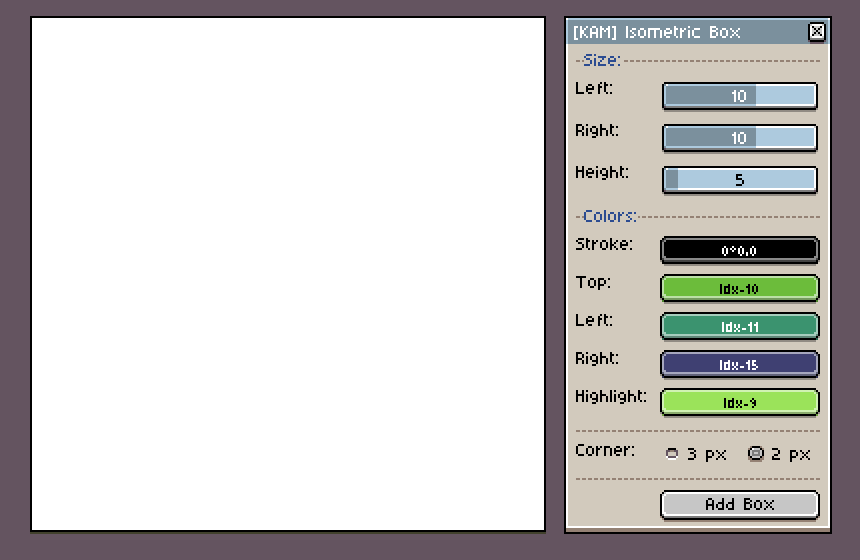
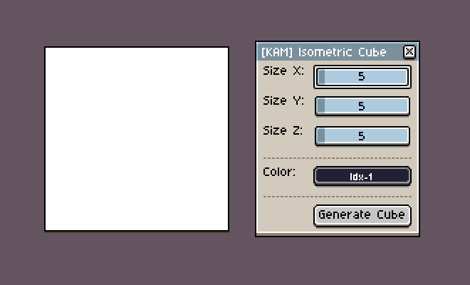
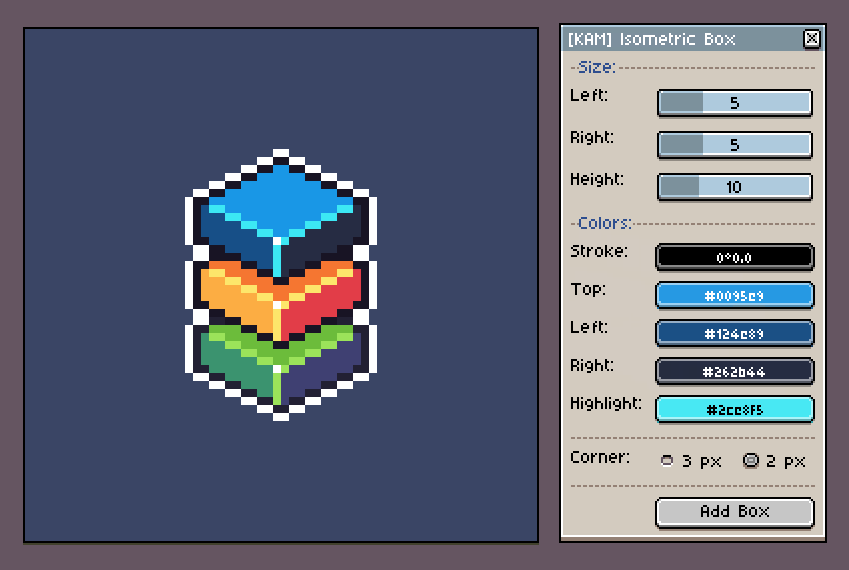

# Isometric Box Generator for Aseprite
This script lets you create boxes of various sizes in [Aseprite](https://www.aseprite.org/):

You can set a custom color for each of the sides, set a highlight and stroke color. You can also choose between two types of the corners: 2px and 3px. You can read more about the differences [here](http://www.gas13.ru/v3/tutorials/isometric_pixelart_tutorial_the_two_types.php).

There are two versions of the script: Regular and Lite. Lite version generates a stroke only boxes, intended for quick prototyping with basic wired box without any colors. 

Using Regular version you can set a custom color for each of the sides of the box. By default it will generate shades of your current foreground color.

## Features
- Custom X, Y and Z size of the box
- Custom colors for Stroke, Highlight and each side of the box
- Two types of the corners: 2px and 3px (Read more)
- Optional Lite version of the script with a basic wired box for quick prototyping

## Requirements:
- [Aseprite 1.2.10-beta2+](https://www.aseprite.org/beta) (“beta - Beta version - Preview features” branch in Steam)
- Color Mode: RGBA

## Installation:
1. Open Aseprite
2. Go to `File → Scripts → Open Scripts Folder`
3. Place downloaded LUA files into previously opened directory
4. Restart Aseprite
You will find installed scripts under `File → Scripts` menu. You can add shortcuts to each script under `Edit → Keyboard Shortcuts` ([Read more](https://twitter.com/ThKasparrr/status/1059168255015825409))

You can also create a separate folder for these scripts for better organization ([Read more](https://twitter.com/TackRadGames/status/1059176888554397696))

---
Special thanks to [@davidcapello](https://twitter.com/davidcapello) for giving tips on how to improve the code 🙌

